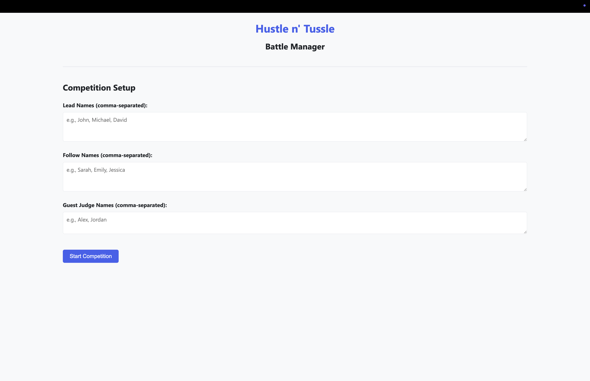
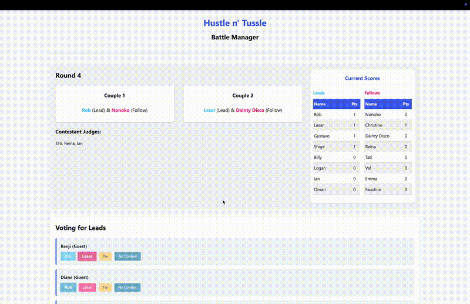
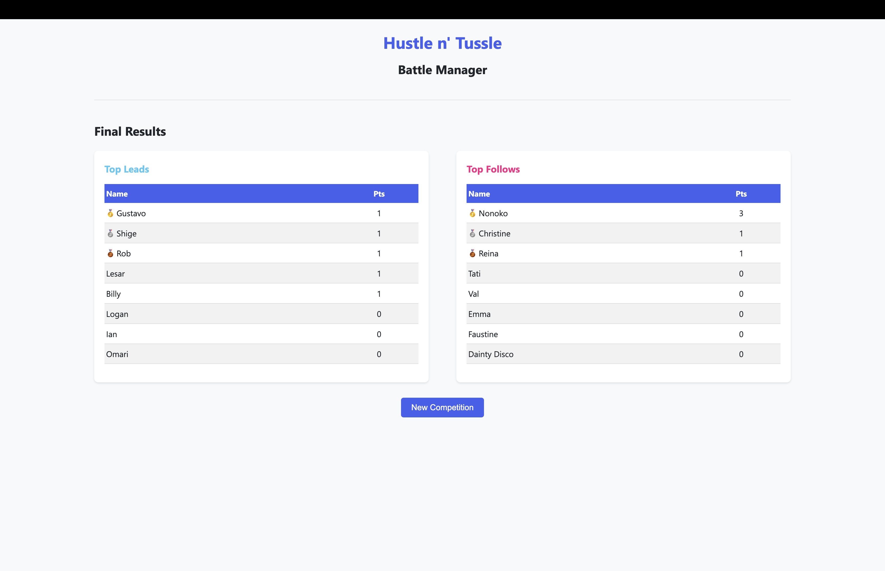

# Hustle n' Tussle - Dance Competition Application

A comprehensive application to manage a partner dance competition between **Leads** and **Follows**. The game randomly pairs dancers, uses **Guest Judges** and **Contestant Judges** to vote each round, supports **Ties** and **No Contest**, tracks individual points, and displays final leaderboards.

Now available with both a CLI and Web interface!

## 📸 Interface Screenshots

### Setup Screen

*Competition setup with fields for lead, follow, and judge names*

### Voting Screen

*Voting interface showing matchups, current scores with crown emojis, and judge voting*

### Results Screen

*Final results showing leaderboards with medals and crown emojis for winners*

---

## 🔧 Installation

1. Clone the repository:
   ```bash
   git clone https://github.com/yourusername/hustle-n-tussle.git
   cd hustle-n-tussle
   ```
2. (Optional) Create a virtual environment and activate it:
   ```bash
   python3 -m venv venv
   source venv/bin/activate   # Mac/Linux
   venv\\Scripts\\activate    # Windows
   ```
3. Install dependencies:
   ```bash
   pip install -r requirements.txt
   ```

---

## 🚀 Usage

### Run the Web Interface (Recommended)

```bash
python web/app.py
```

Then open your browser to http://localhost:5000

- **Enter** lead names, follow names, and guest judge names.
- **Vote** each round for leads and follows through an intuitive interface.
- **Track** scores in real-time with a visual leaderboard.
- **View** winners with crown emojis (👑) highlighting champions.

### Run the Interactive CLI

```bash
python main.py
```

- **Enter** lead names, follow names, and guest judge names (comma-separated).
- **Vote** each round for Leads (with Tie/No Contest options for guests) and for Follows.
- **Results** and points update automatically until winners are determined, or you end the battle early.

### Run Automated Tests

```bash
python test_simulation.py
```

- Validates tie handling, no contest logic, split votes, sweeps, queue behavior, and early exit functionality.
- Outputs a PASS/FAIL summary for all test scenarios.

### Run Simple Simulation

```bash
python simulate_test.py
```

- Walks through 3 rounds of simulated winners to demonstrate pairing logic.

---

## 🌐 Deployment

### Deploying to Render

Hustle n' Tussle can be easily deployed to [Render](https://render.com) using the included configuration files:

1. **Push your code to GitHub**:
   Make sure your code is in a GitHub repository.

2. **Create a Render account**:
   Sign up at [render.com](https://render.com).

3. **Create a new Web Service**:
   - Click "New" and select "Web Service"
   - Connect your GitHub repository
   - Select the repository with Hustle n' Tussle

4. **Configure the service**:
   - Render will automatically detect the Python application
   - Set the following:
     - Name: hustlentussle (or your preferred name)
     - Build Command: `pip install -r requirements.prod.txt`
     - Start Command: `gunicorn wsgi:application`
   - Add environment variables:
     - `FLASK_ENV`: `production`
     - `SECRET_KEY`: Generate a secure random string

5. **Deploy the service**:
   - Click "Create Web Service"
   - Wait for the build and deployment to complete

6. **Connect your custom domain**:
   - In your service dashboard, go to "Settings"
   - Scroll to "Custom Domains"
   - Click "Add Custom Domain"
   - Follow the instructions to configure your domain

For more details, see the [Render documentation](https://render.com/docs).

---

## ⚙️ Features

- **Random Pairing**: Each round pairs one Lead with one Follow.
- **Guest & Contestant Judges**: Guests can choose Tie or No Contest; contestants must pick a winner.
- **Tie Handling**: Both tied dancers gain +1 point and continue to the next round with fresh opponents.
- **No Contest**: No points awarded; previous dancers return to the end of the queue and fresh opponents are selected.
- **Winner Recognition**: Crown emoji (👑) highlights the first contestant to reach the winning threshold.
- **Early Exit**: Option to end the battle early and finalize leaderboards based on current points.
- **Scoring**: Points awarded per win; tracked individually and sorted.
- **Final Leaderboards**: Displays separate Top Leads and Top Follows sorted by points.
- **Multiple Interfaces**: Choose between CLI or Web interface depending on your needs.

---

## 📂 Project Structure

```
hustle-n-tussle/
├── game_logic.py         # Core game engine
├── main.py               # CLI frontend
├── test_simulation.py    # Automated tests with PASS/FAIL summary
├── simulate_test.py      # Simple round simulation script
├── requirements.txt      # External dependencies
├── web/                  # Web interface files
│   ├── app.py            # Flask backend API
│   ├── index.html        # Web UI HTML
│   ├── css/              # Stylesheets
│   ├── js/               # JavaScript files
│   └── README.md         # Web interface documentation
├── .gitignore
└── README.md             # Project documentation
```

---

## 🤝 Contributing

Feel free to submit pull requests or open issues on GitHub. All enhancements and bug fixes are welcome!

---

## 📝 Future Enhancements

1. **Quality of life features**:
   - Implement save and load states
   - Allow results to be exported to CSV/PDF
   - Add Spotify integration for music and logging which song was played for the round
   - Battle history page on website
   - Authentication for judges
   - Mobile application

---

*Enjoy running your dance competition!*
