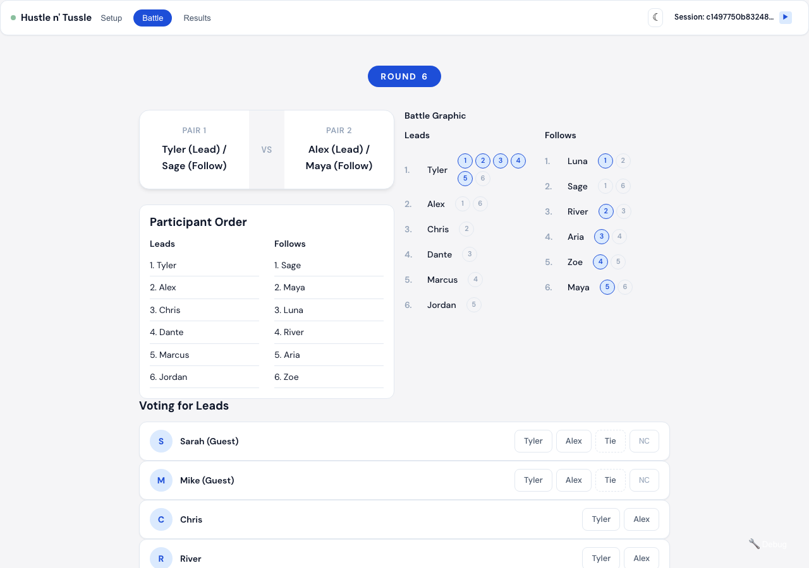
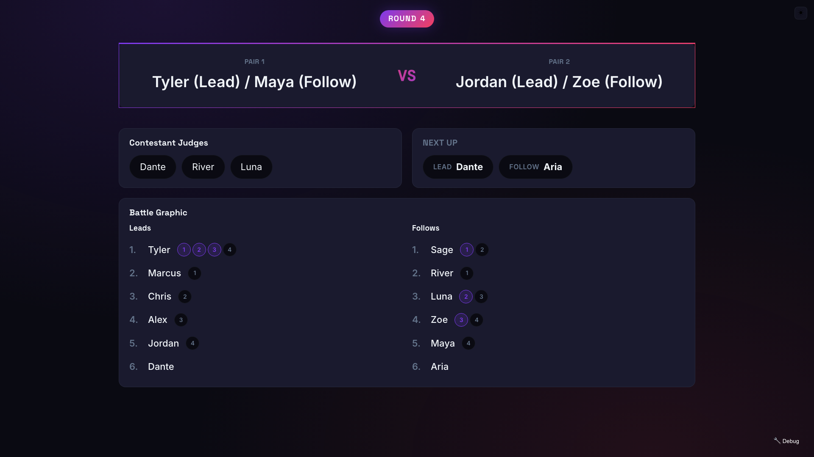
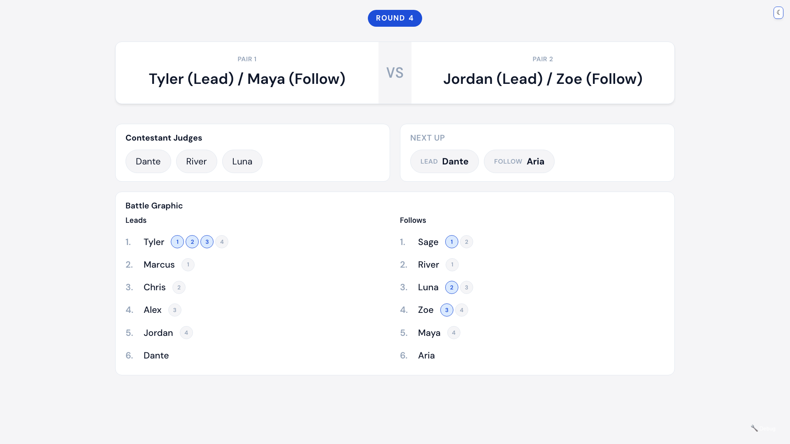

# Hustle n' Tussle

A web app for running partner dance competitions. Available at [hustlentussle.com](https://hustlentussle.com).

## How It Works

A Hustle n' Tussle competition has **Leads**, **Follows**, and **Judges**. Each round, two lead-follow pairs face off on the dance floor. Judges vote on which lead danced better and which follow danced better. Winners earn a point and stay on the floor to face a new challenger from the queue. Losers go to the back of the line.

The first lead to reach the point threshold becomes the **Lead Champion**. The first follow to reach it becomes the **Follow Champion**. The battle ends when both roles have a champion.

### Each Round

1. Two leads and two follows are pulled from the front of the queue to form two competing pairs
2. Judges vote on the **lead matchup** (which lead danced better)
3. Judges vote on the **follow matchup** (which follow danced better)
4. Winners get a point and stay on the floor; losers go to the back of the queue
5. New challengers are pulled from the queue for the next round
6. Repeat until both a lead and follow champion are crowned

### Judging

There are two types of judges:

**Guest Judges** (the MCs / hosts):
- Vote for Contestant 1, Contestant 2, **Tie**, or **No Contest**
- Each vote is worth **2 points**

**Contestant Judges** (other dancers not currently competing):
- Must pick a winner (no Tie or No Contest option)
- Each vote is worth **1 point**
- Randomly selected from non-competing dancers each round

The contestant with more total points wins the round. If scores are exactly tied, the first contestant wins.

### Special Outcomes

| Outcome | What Happens |
|---|---|
| **Tie** (both guest judges vote Tie) | No points awarded. The same two dancers face off again next round. |
| **No Contest** (both guest judges vote No Contest) | No points awarded. Both dancers go to the back of the queue and two fresh opponents are selected. |

### Win Threshold

The point threshold can be configured during setup:

| Mode | Threshold | Best For |
|---|---|---|
| **Default** | 7 points | Standard competitions |
| **Auto-calculate** | `max(leads, follows) - 1` | Scaling to group size |
| **Custom** | Any number you choose | Shorter or longer battles |

## Using the App

Go to [hustlentussle.com](https://hustlentussle.com) and click **Start Battle**.

### Setup

Enter your lead names, follow names, and guest judge names. You can also configure:

- **Randomize order** -- shuffle the starting lineup or keep the entered order
- **Contestant judging** -- toggle on/off (guest judges only mode available)
- **Simple contestant judge mode** -- single group vote button instead of individual contestant judge buttons
- **Number of contestant judges** -- override the default
- **Points to win** -- default (7), auto-calculate, or custom value

### Voting

Each round, cast votes for leads and follows separately. Selected votes are highlighted, and a live preview shows who would win with the current selections. Hit **Confirm Votes** to review a summary before submitting.

You can **Undo Round** to revert a mistake, or **End Battle Early** to determine winners by current standings.

As the battle progresses, the battle graphic tracks every round's results for all contestants. Winning rounds are highlighted so you can follow each dancer's journey at a glance.

### Results

When the battle ends, you'll see final leaderboards with point progression for every contestant, plus a collapsible round-by-round history.

Click **Download Battle Data** to export a multi-sheet Excel file with the full battle summary, leaderboards, round history, and vote-by-vote breakdown. You can re-import this file later using **Upload Results** from the home screen.

### Display Mode

Share a spectator-only view of the battle on a projector or second screen. The display shows the current matchup, contestant judges, who's next up, and the full battle graphic -- all optimized for projector legibility. A QR code and display URL are shown in the header during the battle -- audience members can scan it to follow along live. The display auto-refreshes every 3 seconds.

### Spotify Integration

Toggle Spotify from the header to add music to your battle:

- **Playlist mode** -- link a Spotify playlist and the app randomly selects an unused track each round
- **Manual mode** -- paste a Spotify track URL per round

Song title, artist, and link are saved in the battle export.

### Theme

Toggle between light and dark mode from the header.

## Contributing

Pull requests and issues are welcome on [GitHub](https://github.com/OmariM/hustlentussle).
