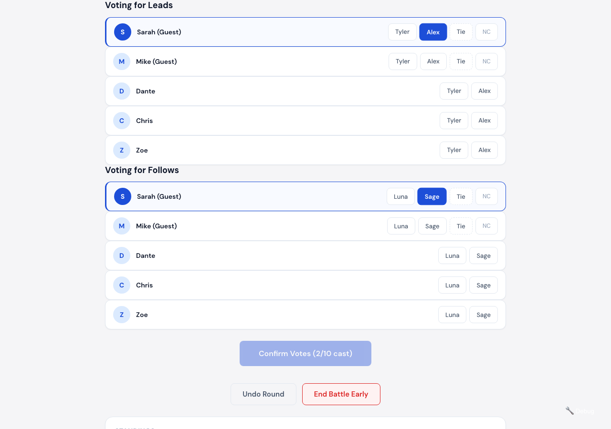
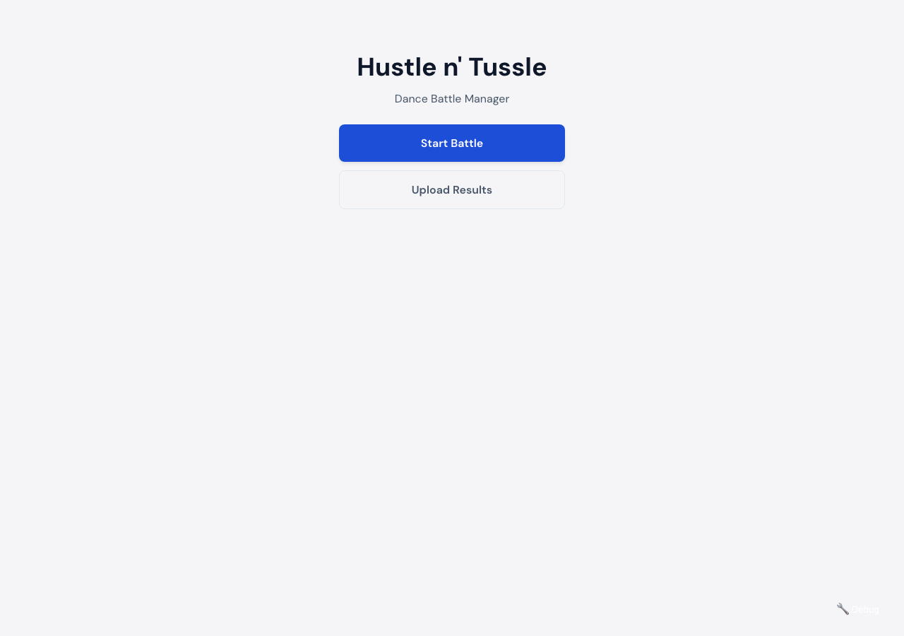
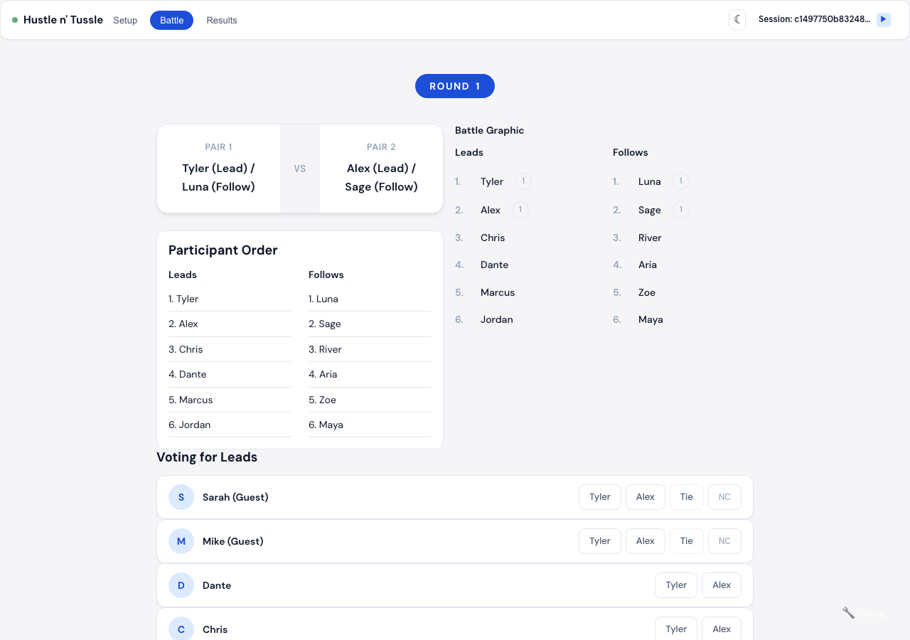
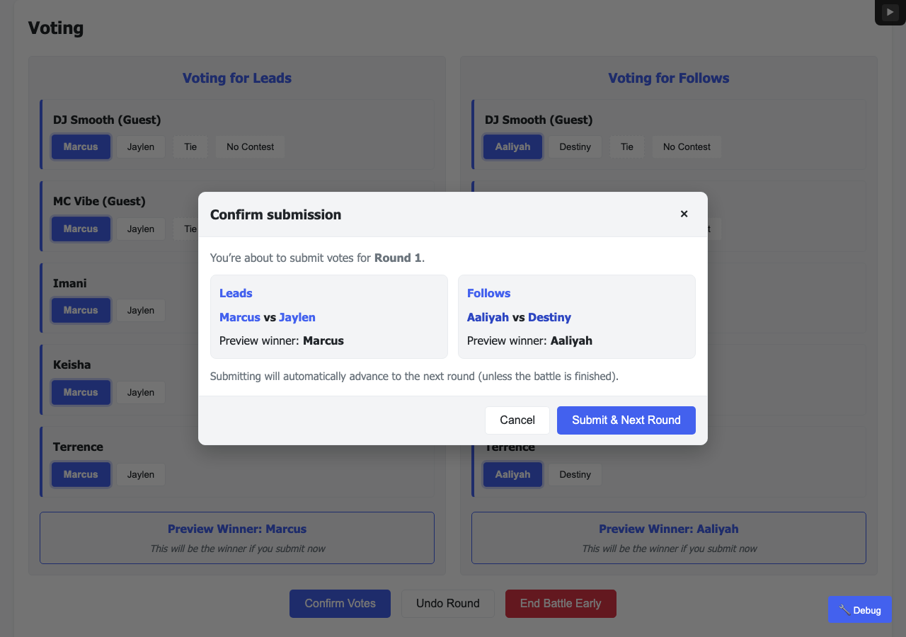

# Hustle n' Tussle

A web app for running partner dance competitions. Two pairs of dancers battle each round, judges vote on winners, and points accumulate until a lead champion and follow champion are crowned.



## How It Works

### The Basics

A Hustle n' Tussle competition has **Leads**, **Follows**, and **Judges**. Each round, two lead-follow pairs face off on the dance floor. Judges vote on which lead danced better and which follow danced better. Winners earn a point and stay on the floor to face a new challenger from the queue. Losers go to the back of the line.

The first lead to reach the point threshold becomes the **Lead Champion**. The first follow to reach it becomes the **Follow Champion**. The battle ends when both roles have a champion.

### Round-by-Round Flow

1. Two leads and two follows are pulled from the front of the queue to form two competing pairs
2. Judges vote on the **lead matchup** (which lead danced better)
3. Judges vote on the **follow matchup** (which follow danced better)
4. Winners get a point and stay on the floor; losers go to the back of the queue
5. New challengers are pulled from the queue for the next round
6. Repeat until both a lead and follow champion are crowned

### Voting Rules

There are two types of judges, each with different voting powers:

**Guest Judges** (the MCs / hosts):
- Vote for Contestant 1, Contestant 2, **Tie**, or **No Contest**
- Each vote is worth **2 points**

**Contestant Judges** (other dancers not currently competing):
- Must pick a winner (no Tie or No Contest option)
- Each vote is worth **1 point**
- Randomly selected from non-competing dancers each round

The contestant with more total points wins the round. If scores are exactly tied, the first contestant wins.

### Special Outcomes

| Outcome | What Happens |
|---|---|
| **Tie** (both guest judges vote Tie) | No points awarded. The same two dancers face off again next round. |
| **No Contest** (both guest judges vote No Contest) | No points awarded. Both dancers go to the back of the queue and two fresh opponents are selected. |

### Win Threshold

The point threshold can be configured three ways during setup:

| Mode | Threshold | Best For |
|---|---|---|
| **Default** | 7 points | Standard competitions |
| **Auto-calculate** | `max(leads, follows) - 1` | Scaling to group size |
| **Custom** | Any number you choose | Shorter or longer battles |

## Screenshots

### Home Screen


### Setup Screen


### Battle Screen


### Voting with Selections


### Vote Confirmation


### Results Screen


## Getting Started

### Installation

```bash
git clone https://github.com/OmariM/hustlentussle.git
cd hustlentussle
python3 -m venv venv
source venv/bin/activate
pip install -r requirements.txt
```

### Run the Web App

```bash
python web/app.py
```

Open http://localhost:5000 in your browser.

### Run the CLI

```bash
python main.py
```

Enter contestant and judge names when prompted. Vote each round until champions are determined.

## Features

### Core Competition
- **Queue-based pairing**: Dancers rotate through a FIFO queue so everyone gets floor time
- **Dual judging system**: Guest judges (2x weight, can call Ties/No Contests) + contestant judges (1x weight, must pick a winner)
- **Undo round**: Revert the last round if a mistake was made (restores queue state and points)
- **End battle early**: Stop at any time and determine winners by current standings
- **Live scoreboard**: Real-time points display with crown for the current leader

### Setup Options
- **Randomize order**: Shuffle the starting lineup or keep the entered order
- **Contestant judging toggle**: Turn contestant judges on or off (guest judges only mode)
- **Simple contestant judge mode**: Replaces individual contestant judge buttons with a single group vote for a cleaner UI
- **Custom judge count**: Override the default number of contestant judges

### Display Mode
Share a spectator-only view of the battle on a projector or second screen:
```
http://localhost:5000?mode=display&session_id=YOUR_SESSION_ID
```
- Auto-refreshes every 3 seconds to show live results
- QR code in the header for easy sharing with audience members

### Spotify Integration
Optionally connect Spotify to add music metadata to your battle:
- **Playlist mode**: Link a Spotify playlist and the app randomly selects an unused track each round
- **Manual mode**: Paste a Spotify track URL per round
- Song title, artist, and link are saved in the battle export

Requires `SPOTIFY_CLIENT_ID` and `SPOTIFY_CLIENT_SECRET` environment variables.

### Export & Upload
- **Download battle data**: Multi-sheet Excel file with battle summary, leaderboards, full round history, and vote-by-vote breakdown
- **Upload past results**: Re-import a previous `.xlsx` export to review historical battles

### Other
- **Light/dark theme**: Toggle from the header
- **Session persistence**: PostgreSQL in production, in-memory for development (auto-fallback). Sessions expire after 6 hours.
- **Debug tools**: Enable via `ENABLE_DEBUG_TOOLS=true`, `?debug=1` query param, or `Alt+Shift+D`

## Deployment

Hustle n' Tussle deploys to [Render](https://render.com) with the included `render.yaml`:

1. Push your code to GitHub
2. Create a new Web Service on Render and connect your repo
3. Set build command: `pip install -r requirements.prod.txt`
4. Set start command: `gunicorn wsgi:application`
5. Add environment variables:
   - `FLASK_ENV`: `production`
   - `SECRET_KEY`: a secure random string
   - `SPOTIFY_CLIENT_ID` / `SPOTIFY_CLIENT_SECRET` (optional)

See [docs/render-deployment.md](docs/render-deployment.md) for a detailed guide.

## Running Tests

```bash
# Full test suite (32 tests: battle rules, voting, pairing, stress tests)
python run_complete_test_suite.py

# Unit and API tests
python unit_tests.py

# Individual test files
python battle_rules_test_suite.py
python voting_rules_tests.py
python pairing_rules_tests.py

# Simulation demo
python simulate_test.py
```

## Project Structure

```
hustlentussle/
├── game_logic.py                # Core game engine
├── main.py                      # CLI interface
├── web/
│   ├── app.py                   # Flask backend + REST API
│   ├── index.html               # Single-page web UI
│   ├── config.py                # Environment-aware config
│   ├── css/                     # Stylesheets
│   └── js/                      # Frontend JavaScript
├── persistence/
│   ├── interfaces.py            # Repository interface
│   ├── memory_repository.py     # In-memory storage (dev)
│   ├── postgres_repository.py   # PostgreSQL storage (prod)
│   ├── factory.py               # Factory + fallback + cleanup
│   └── serializers.py           # Game state serialization
├── *_test*.py                   # Test suites
├── requirements.txt             # Dev dependencies
├── requirements.prod.txt        # Production dependencies
├── wsgi.py                      # WSGI entrypoint
└── render.yaml                  # Render deployment config
```

## Contributing

Pull requests and issues are welcome on GitHub.
