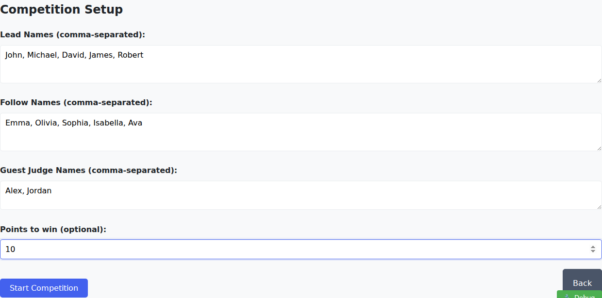
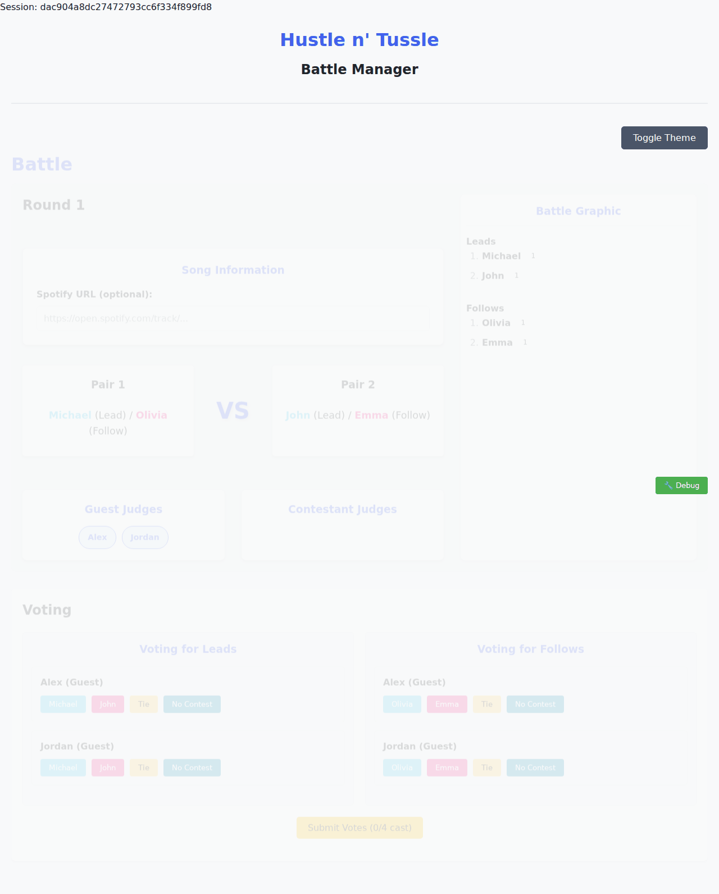
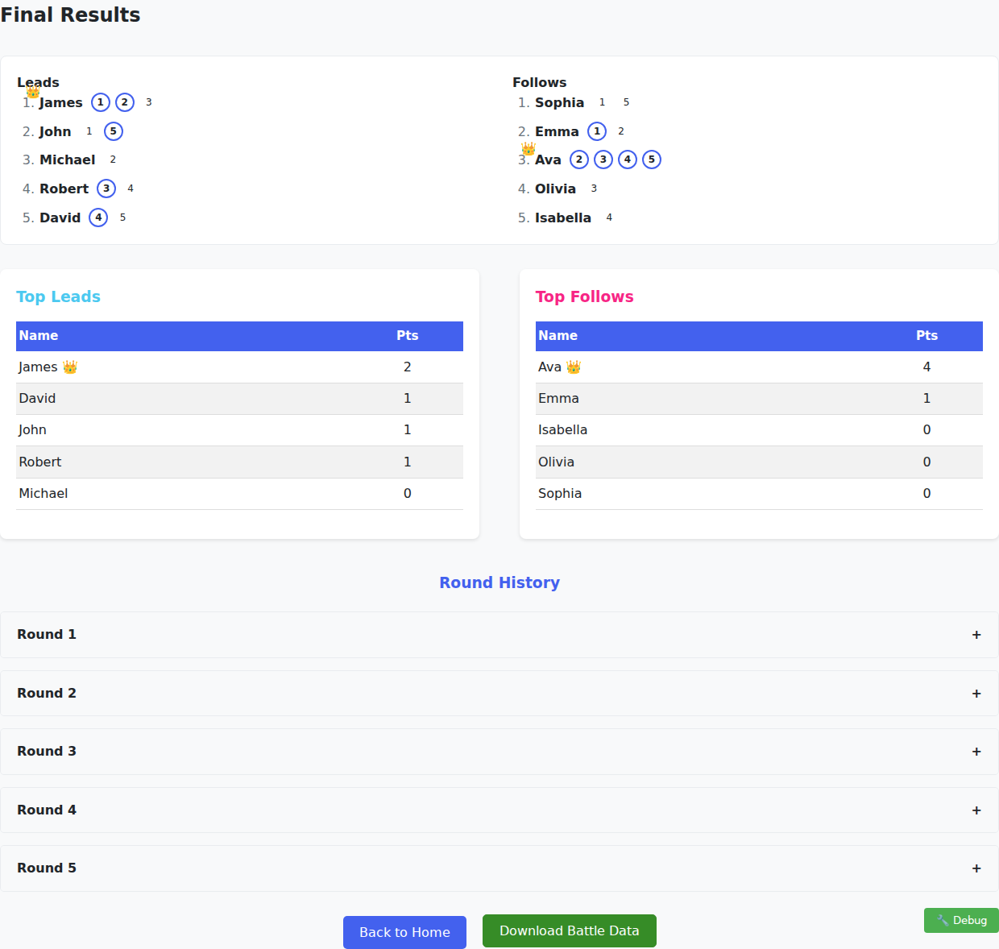

# Hustle n' Tussle - Web Interface

This is a modern web interface for the Hustle n' Tussle Dance Competition Manager, built using HTML, CSS, and JavaScript with a Flask backend.

## 📸 UI Screenshots

### Setup Screen

*Competition setup with fields for lead, follow, and judge names*

### Voting Screen

*Voting interface showing matchups, current scores with crown emojis, and judge voting*

### Results Screen

*Final results showing leaderboards with medals and crown emojis for winners*

## Features

- All the functionality of the CLI version in a user-friendly web interface
- Combined voting flow for Leads and Follows with a single Submit All Votes
- Battle Graphic and real-time score updates
- Crown emoji (👑) highlights the first contestant to reach the winning threshold
- Upload Results page to visualize a previously downloaded .xlsx export
- Download Battle Data (Excel multi-sheet or JSON)
- Optional Spotify metadata for songs (track title/artist from pasted Spotify URL)
- Theme toggle (light/dark)
- Responsive design

## Setup and Installation

1. Make sure you have installed the required Python dependencies:
   ```bash
   pip install -r ../requirements.txt
   ```

2. Run the Flask application:
   ```bash
   python web/app.py
   ```

3. Open your browser and navigate to:
   ```
   http://localhost:5000
   ```

## How to Use

1. Home:
   - Start Battle or Upload Results

2. Setup:
   - Enter lead, follow, and guest judge names (comma-separated)
   - Optional: set a custom points-to-win value

3. Battle:
   - View current matchups and judges
   - Paste a Spotify track URL (optional)
   - Cast votes for Leads and Follows, then Submit All Votes
   - See live results and proceed to Next Round or End Battle

4. Results:
   - View leaderboards for Leads and Follows, round history, and download battle data

5. Upload:
   - Upload a previously downloaded .xlsx battle results file to view summary and leaderboards

## Technical Details

- Frontend: HTML, CSS, and JavaScript (no frameworks)
- Backend: Flask API that interfaces with `game_logic.py`
- Data Flow: Fetch API calls manage the game state on the server
- Debug Tools: Enable via env, append `?debug=1`, or press Alt+Shift+D

## Browser Compatibility

Tested and working on:
- Chrome (latest)
- Firefox (latest)
- Safari (latest)
- Edge (latest) 